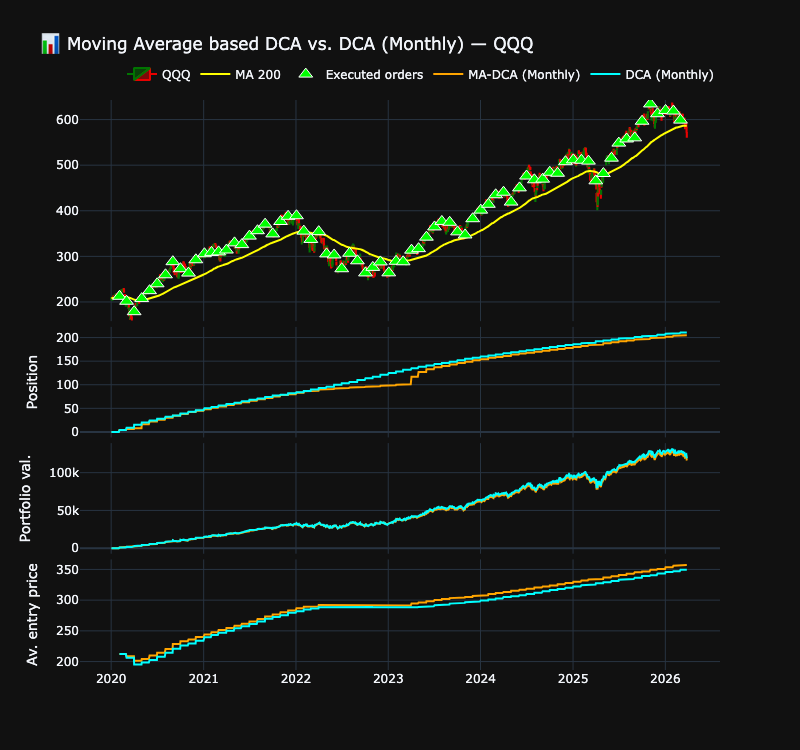
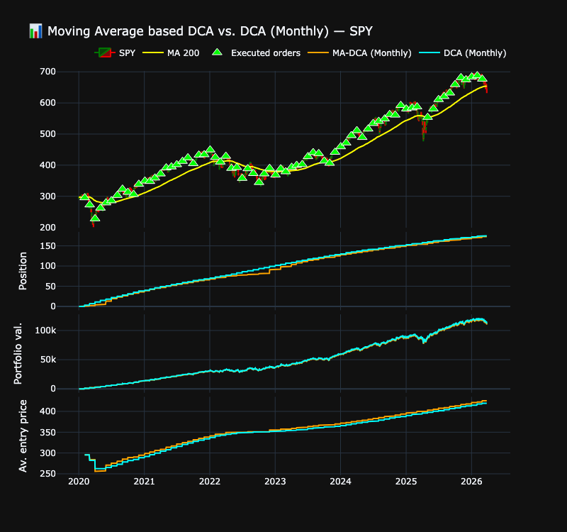
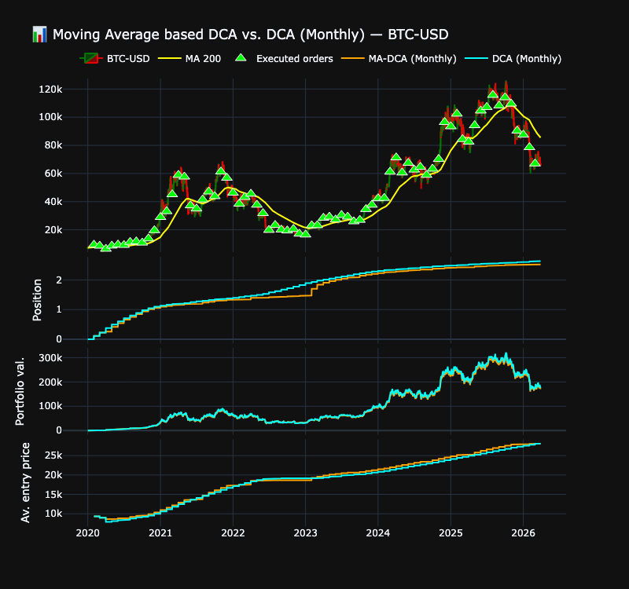

# 📊 Moving average conditioned DCA Strategy vs. regular DCA

## Overview

This project explores an enhancement of the traditional Dollar Cost Averaging (DCA) strategy by conditioning investments based on a moving average signal.

Instead of investing a fixed amount at regular intervals regardless of market conditions, this strategy dynamically adjusts the invested amount depending on whether the price is above or below a selected moving average.

The goal is to improve capital allocation efficiency while preserving the robustness and simplicity of DCA.

The backtest includes:

- Full trade simulation  
- Cash tracking  
- Position sizing  
- Portfolio valuation  
- IRR computation (annualized)  
- Interactive visualization with Plotly  

## Strategy Description

### 1️⃣ Regular Weekly DCA

- Invests a fixed amount every month.
- Buys at the **open price of the first trading day of each new month**.
- Option to allow or disallow fractional shares.
- Uninvested cash is carried forward.

This strategy serves as the benchmark.

### 2️⃣ Moving Average Conditioned DCA

The strategy introduces a simple regime filter based on a moving average:

- Above Moving Average
    - Market considered bullish
    - Invest full (or increased) monthly amount
- Below Moving Average
    - Market considered bearish
    - Reduce investment (or partially accumulate cash)

This creates a dynamic allocation mechanism that:

- Reduces exposure during downtrends
- Preserves capital for better entry points
- Increases participation in upward trends

## Parameters

Available backtest parameters:

```python
ticker = "QQQ" # Ticker name
start_date = "2025-11-04" # Backtest start date
monthly_budget = 1000  # monthly budget to be invested
allow_fractional_shares = False # buy fractional shares of the asset
```

MA conditioned DCA parameters:

```python
MA_DCA_params = {
    "ma_filter": True, # Use MA position for the strategy
    "period": 200, # EMA period
}
```

## Limitations

- No transaction costs
- No slippage modeling
- No tax considerations
- No liquidity constraints
- Assumes perfect order execution

## Disclaimer

This code is provided for educational and informational purposes only.
It does not constitute investment advice.
The author assumes no responsibility for financial decisions made based on this project.

## NASDAQ backtest

Using following parameters:

```python
ticker = "QQQ" # NASDAQ-100
start_date = "2020-01-01"
monthly_budget = 1000  # monthly budget to be invested
allow_fractional_shares = False # buy fractional shares of the asset

MA_DCA_params = {
    "ma_filter": True, # Use MA position for the strategy
    "period": 200, # MA period
}
```

We get following results:

```
--- MA-based DCA ---
Total cash invested: 74,000
Final portfolio value: 116,087
Total return: 56.87%
Annualized IRR: 14.44%
QQQ final position: 205.0000
Remaining cash : 757.67

--- DCA ---
Total cash invested: 74,000
Final portfolio value: 118,938
Total return: 60.73%
Annualized IRR: 15.23%
QQQ final position: 211.0000
Remaining cash : 234.03
```


## S&P 500 backtest

Using following parameters:

```python
ticker = "SPY" # S&P500
start_date = "2020-01-01"
monthly_budget = 1000  # monthly budget to be invested
allow_fractional_shares = False # buy fractional shares of the asset

MA_DCA_params = {
    "ma_filter": True, # Use MA position for the strategy
    "period": 200, # MA period
}
```

We get following results:

```
--- MA-based DCA ---
Total cash invested: 74,000
Final portfolio value: 110,072
Total return: 48.75%
Annualized IRR: 12.73%
SPY final position: 173.0000
Remaining cash : 374.12

--- DCA ---
Total cash invested: 74,000
Final portfolio value: 111,581
Total return: 50.78%
Annualized IRR: 13.17%
SPY final position: 175.0000
Remaining cash : 614.80
```


## BTC/USD backtest

Using following parameters:

```python
ticker = "BTC-USD"
start_date = "2020-01-01"
monthly_budget = 1000  # monthly budget to be invested
allow_fractional_shares = True # buy fractional shares of the asset

MA_DCA_params = {
    "ma_filter": True, # Use MA position for the strategy
    "period": 200, # MA period
}
```

We get following results:

```
--- MA-based DCA ---
Total cash invested: 74,000
Final portfolio value: 170,314
Total return: 130.15%
Annualized IRR: 26.93%
BTC-USD final position: 2.5206
Remaining cash : 3212.70

--- DCA ---
Total cash invested: 74,000
Final portfolio value: 174,903
Total return: 136.36%
Annualized IRR: 27.80%
BTC-USD final position: 2.6383
Remaining cash : 0.00
```

